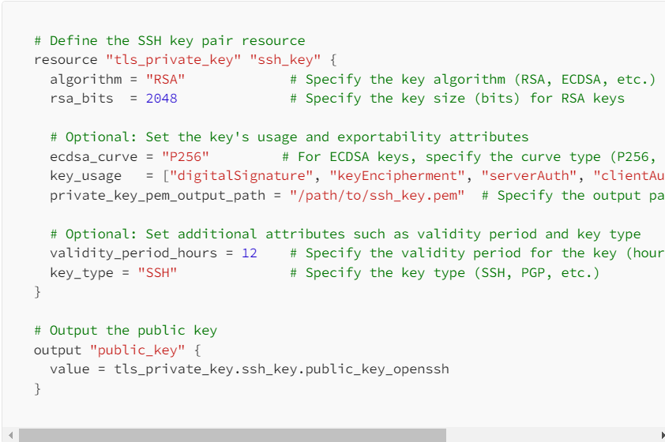
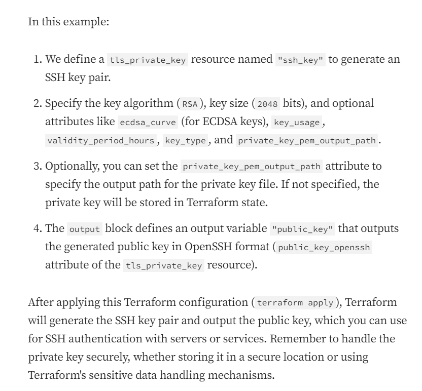
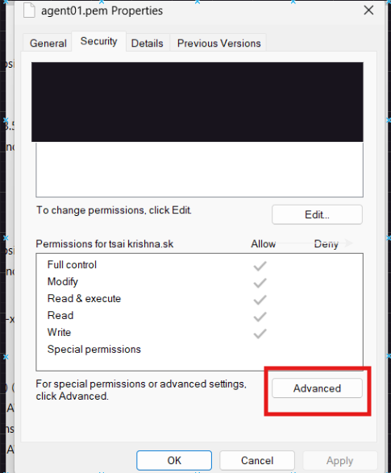
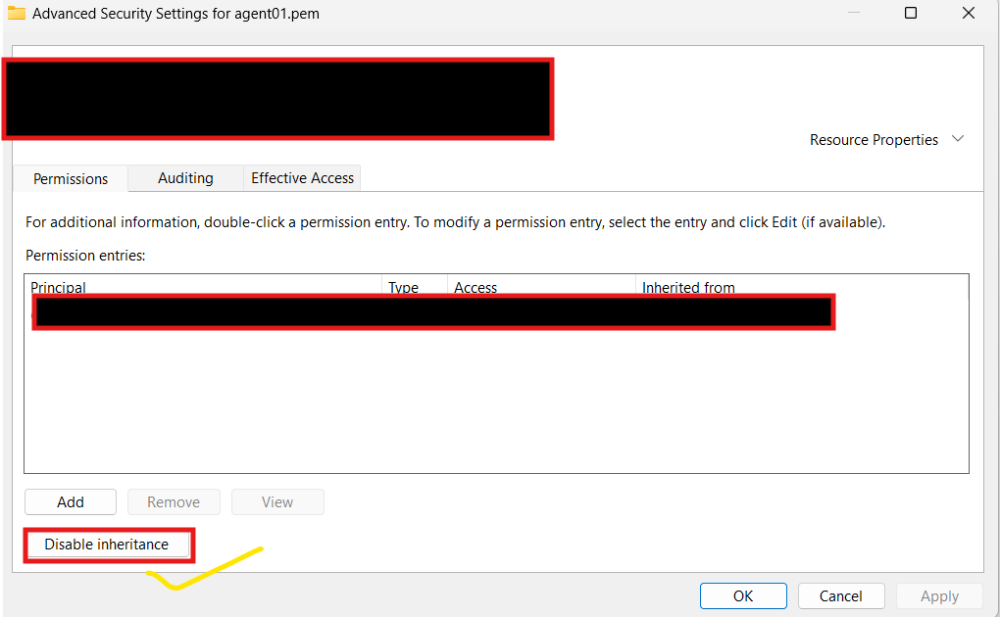

### Introduction
* We have a requirement to generate an SSH keypair in Azure using terraform which can be used to access VMs after the keypair is created.
* To create an SSH key using Terraform, you can utilize the tls_private_key resource provided by the Terraform tls provider. 
* This resource allows you to generate an SSH key pair programmatically within your Terraform configuration.
* Here's an example of how to create an SSH key pair using Terraform:
 
 

 #### Implement the Terraform code

 * Create a main.tf file and use the above example to implement it.
 * Here i have used  "local file" which generates a local file with the given content.
 * With this resource you can actually declare the path of your ssh key file getting into your system
 * Create output.tf file to see your Infra Id's or Any thing after applying the terraform code.

 #### Resource Types Used:

```
tls_private_key             # For Creating  a PEM (and OpenSSH) formatted private key.
local_file                  # For Generating  a local file with the given content.
azurerm_ssh_public_key      # For managing  a SSH Public Key.
```
## Module 

* Modules are the key ingredient to writing reusable, maintainable, and testable Terraform code.
* A Terraform module is very simple: any set of Terraform configuration files in a folder is a module.
* Syntax for using a module
```
module "< NAME >" {
    source = "< SOURCE >"

    [CONFIG ...]
}
```

* ***NAME***  is an identifier you can use throughout the Terraform code to refer to this module.
* ***SOURCE*** is the path where the module code can be found.
* ***CONFIG*** consists of arguments that are specific to that module.

### SSH Key Terraform Module

* Terraform Module to create ssh key locally and access it in Azure 

* Type of resources are supported:

   * [tls_private_key](https://registry.terraform.io/providers/hashicorp/tls/latest/docs/resources/private_key)
   * [local_file](https://registry.terraform.io/providers/hashicorp/local/latest/docs/resources/file)
   * [azurerm_ssh_public_key](https://registry.terraform.io/providers/hashicorp/azurerm/latest/docs/resources/ssh_public_key)

* After writing the code lets implement following steps

### Module Usage 

```
module "Virtual_Network" {
  source = "..//.." # Here You can give path to your vnet files located

  # Give your Configurations details from root module which  bascially are from  variables section of their respective resources

}
```
* This module by default creates ssh key into your local file i.e., private key is added into local file and your public key is added to ssh keys in Azure.

#### Terraform Usage

##### Initialize Terraform

* The terraform init command initializes a working directory containing Terraform configuration files.

```
terraform init
```
##### Validate Terraform

* The terraform validate command validates the configuration files in a directory.Validate runs checks that verify whether a configuration is syntactically valid and internally consistent, regardless of any provided variables or existing state.

```
terraform validate
```

##### Possibility of Error Occurences

* Here I have used local file to specify key path give correctly
* You can ignore local file and also execute the code so the ssh key will generate into the path where you have initialized terraform.
* The key which generated is giving bad permission error when trying to connect to virtual machine
* So change Permissions of key give only read access permissions to user.
* Here I have changed it manually with following steps 


* Then add your default user detail and give only read permissions
                  
                  Or
           
* To give permissions while writing code , then give file permission `0400` in local file 

##### Terraform execution plan

* The terraform plan command creates an execution plan, which lets you preview the changes that Terraform plans to make to your infrastructure.

```
terraform plan -out main.tfplan
```
##### Apply a Terraform execution plan

* The terraform apply command executes the actions proposed in a Terraform plan

```
terraform apply main.tfplan
```

* Verify the results 

##### Terraform Destroy

* The terraform destroy command terminates resources managed by your Terraform project.
* After Completion Of your Project or needs, if you want to terminate resources created use terraform destroy.
```
terraform destroy 
    or 
terraform destroy -auto-approve  
