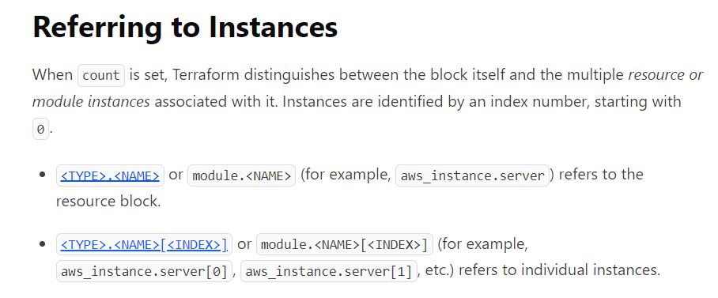
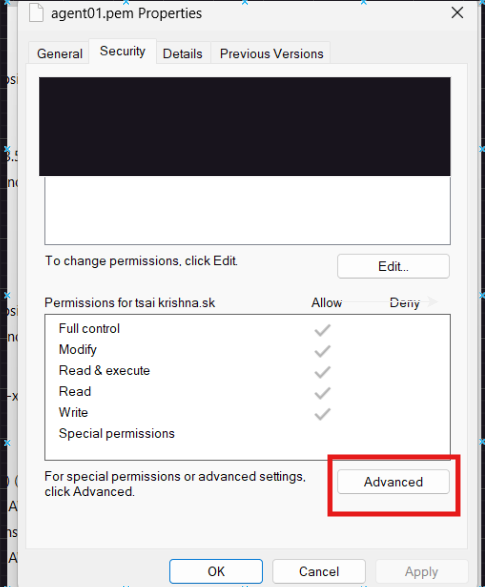
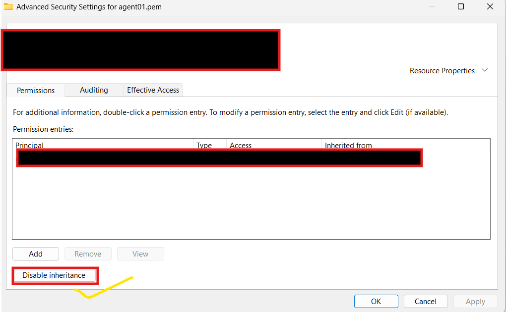
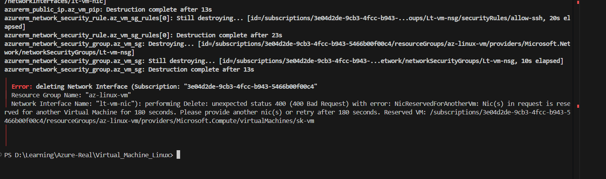

### Introduction
------------------------------------------------------------------
* We can create and run virtual machines (VMs) in the cloud using Microsoft Azure’s Azure Virtual Machine service without having to manage the  infrastructure. We might set up the required OS in the virtual machine, like Linux, Windows, or Mac.
* Here I am creating a  complete Linux environment and supporting resources with Terraform. Those resources include a virtual network, subnet, public IP address, and more.

In this Section, you learn about a Terraform script that creates an Resource Group, Virtual Network,Security Group,Network Interface,Ssh Keys and Linux Virtual Machine.

#### Implement the Terraform code
------------------------------------------------------------------
* Here I have Created a files for every resource i have used to keep the better understanding.In main.tf file given configurations of linux vrtual machine.
* For creating linux virtual machine main.tf file, use help of official docs [Refer here](https://registry.terraform.io/providers/hashicorp/azurerm/latest/docs/resources/linux_virtual_machine)
* For creating resource_group.tf file, use help of official docs [Refer here](https://registry.terraform.io/providers/hashicorp/azurerm/latest/docs/resources/resource_group)
* For creating virtual_network.tf file, use help of official docs [Refer here](https://registry.terraform.io/providers/hashicorp/azurerm/latest/docs/resources/virtual_network)
* For Creating Security_group.tf file, use help of official docs [Refer here](https://registry.terraform.io/providers/hashicorp/azurerm/latest/docs/resources/network_security_group)
     * In securit_group.tf file for creating security rules, use help of official docs [Refer here](https://registry.terraform.io/providers/hashicorp/azurerm/latest/docs/resources/network_security_rule)
* For Creating Public_ip.tf file, use help of official docs [Refer here](https://registry.terraform.io/providers/hashicorp/azurerm/latest/docs/resources/public_ip)     
* For Creating network_interface.tf file, use help of official docs [Refer here](https://registry.terraform.io/providers/hashicorp/azurerm/latest/docs/resources/network_interface)
    * In network_interface.tf file  for network interface security group association, use help of official docs [Refer here](https://registry.terraform.io/providers/hashicorp/azurerm/latest/docs/resources/network_interface_security_group_association)
* For ssh_key.tf file, use help of official docs [Refer here](https://registry.terraform.io/providers/hashicorp/azurerm/latest/docs/resources/ssh_public_key)
     * In ssh_key.tf file for tls private key use help of official doc [Refer here](https://registry.terraform.io/providers/hashicorp/tls/latest/docs/resources/private_key)
* Input variables let you customize aspects of Terraform modules without altering the module's own source code.
* Create a file named variable.tf and configure according to your files.
* Create output.tf file to see your Infra Id's or Any thing after applying the terraform code.

#### Resource Types Used:
------------------------------------------------------------------
```
 "azurerm_resource_group"                                   # For Resource Group
 "azurerm_virtual_network"                                  # For Virtual Network
 "azurerm_subnet"                                           # For Subnet
 "azurerm_network_security_group"                           # For Security Group
 "azurerm_network_security_rule"                            # For Security Rule
 "azurerm_public_ip"                                        # For Public Ip    
 "azurerm_network_interface"                                # For Network Interface
 "azurerm_network_interface_security_group_association"     #   For Network Interface Security Group Assosciation
 "tls_private_key" "az_vm_tls_key"                          #  For tls Private Key
 "azurerm_ssh_public_key"                                   #  For ssh Public Key
 "azurerm_linux_virtual_machine"                            # For Linux Virtual Machine
 
 ```
## Module 
------------------------------------------------------------------

* Modules are the key ingredient to writing reusable, maintainable, and testable Terraform code.
* A Terraform module is very simple: any set of Terraform configuration files in a folder is a module.
* Syntax for using a module
```
module "< NAME >" {
    source = "< SOURCE >"

    [CONFIG ...]
}
```

* ***NAME***  is an identifier you can use throughout the Terraform code to refer to this module.
* ***SOURCE*** is the path where the module code can be found.
* ***CONFIG*** consists of arguments that are specific to that module.


### Azure Linux Virtual Machine(UBUNTU) Module

* Terraform Module to create Azure Virtual Network.

* Type of resources are supported:

  * ["azurerm_resource_group"](https://registry.terraform.io/providers/hashicorp/azurerm/latest/docs/resources/resource_group)
  * ["azurerm_virtual_network"](https://registry.terraform.io/providers/hashicorp/azurerm/latest/docs/resources/virtual_network)
  * ["azurerm_subnet" "az_vm_subnet"](https://registry.terraform.io/providers/hashicorp/azurerm/latest/docs/resources/subnet)
  * ["azurerm_network_security_group"](https://registry.terraform.io/providers/hashicorp/azurerm/latest/docs/resources/network_security_group)
  * ["azurerm_network_security_rule"](https://registry.terraform.io/providers/hashicorp/azurerm/latest/docs/resources/network_security_rule)
  * ["azurerm_network_interface"](https://registry.terraform.io/providers/hashicorp/azurerm/latest/docs/resources/network_interface)
  * ["azurerm_network_interface_security_group_association"](https://registry.terraform.io/providers/hashicorp/azurerm/latest/docs/resources/network_interface_security_group_association)
  * ["azurerm_public_ip"](https://registry.terraform.io/providers/hashicorp/azurerm/latest/docs/resources/public_ip)
  * ["tls_private_key"](https://registry.terraform.io/providers/hashicorp/tls/latest/docs/resources/private_key)
  * ["local_file"](https://registry.terraform.io/providers/hashicorp/local/latest/docs/resources/file)
  * ["azurerm_ssh_public_key"](https://registry.terraform.io/providers/hashicorp/azurerm/latest/docs/resources/ssh_public_key)
  * ["azurerm_linux_virtual_machine"](https://registry.terraform.io/providers/hashicorp/azurerm/latest/docs/resources/linux_virtual_machine)
  
### Module Usage 

```
module "Virtual_Network" {
  source = "..//.." # Here You can give path to your vnet files located

  # Give your Configurations details from root module which  bascially are from  variables section of their respective resources
}

```
* This module by default creates a linux virtual machine with all basic given configueations.You can configure names and data according to your needs if you want to.

* After writing the code lets implement following steps

#### Terraform Usage

##### Initialize Terraform

* The terraform init command initializes a working directory containing Terraform configuration files.

```
terraform init
```
##### Validate Terraform

* The terraform validate command validates the configuration files in a directory.Validate runs checks that verify whether a configuration is syntactically valid and internally consistent, regardless of any provided variables or existing state.

```
terraform validate
```

##### Possibility of Error Occurences


 #### Meta-argument 

 ****count**** : I have used this meta argument in various files for creating multiple scenarios.

     * count is a meta-argument defined by the Terraform language. It can be used with modules and with every resource type.
     * The basic syntax referring to instances would be something like this
       
     * Use this with proper syntax otherwise chances of getting errors are high.

* In variable section for securtiy group rules i have used type is " list(objective({string})) " .

* While giving default values Priority should be distinct value for each otherwise it throws an error.

* You can ignore local file and also execute the code so the ssh key will generate into the path where you have initialized terraform.

* The key which generated is giving bad permission error when trying to connect to virtual machine.
* So change Permissions of key give only read access permissions to user.
* Here I have changed it manually with following steps 
   
   

* In network_interface.tf file ensure you create a life cycle and give `create before destroy ` = `true`. It is just to make sure when you are destoying the network interface also gets deleted, otherwise you get an error while destroying bad error
  

* In main.tf file
    * Give details of `size` syntax correctly otherwise it throws an error, the specified size is not part of it.
    * In source image reference give details of it correctly i.e., make sure it synatax is correct of it

##### Terraform execution plan

* The terraform plan command creates an execution plan, which lets you preview the changes that Terraform plans to make to your infrastructure.

```
terraform plan -out main.tfplan
```
##### Apply a Terraform execution plan

* The terraform apply command executes the actions proposed in a Terraform plan

```
terraform apply main.tfplan
```

* Verify the results 

##### Terraform Destroy

* The terraform destroy command terminates resources managed by your Terraform project.
* After Completion Of your Project or needs, if you want to terminate resources created use terraform destroy.
```
terraform destroy 
    or 
terraform destroy -auto-approve  
```  
