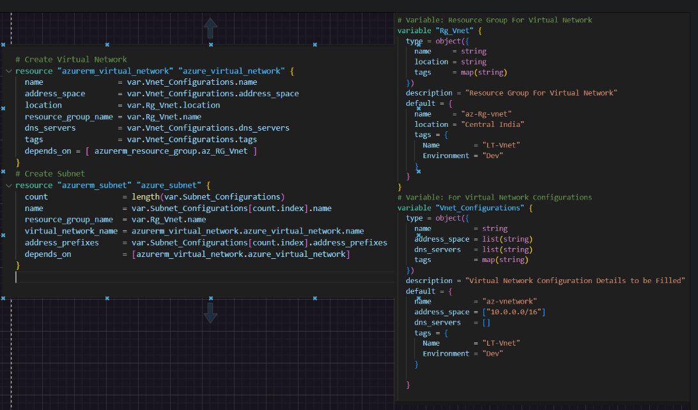
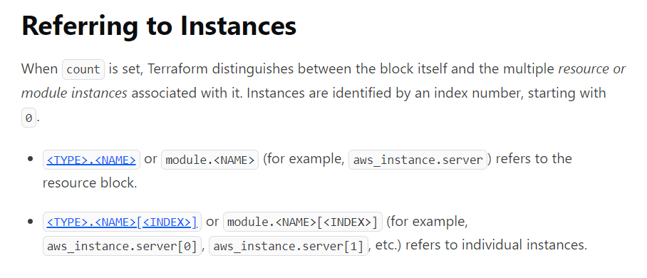

### Introduction
* Azure Virtual Network is a service that provides the fundamental building block for your private network in Azure.
* Key scenarios that you can accomplish with a virtual network include:
    
    * Communication of Azure resources with the internet.
    * Communication between Azure resources.
    * Communication with on-premises resources.
    * Filtering of network traffic
    * Routing of network traffic.
    * Integration with Azure services

* In this Section , you learn about a Terraform script that creates an Azure resource group and a virtual network with four subnets.

#### Implement the Terraform code

* Create a Resource group file or add Directly to main.tf file, either ways its possible.Here I am using separate resource-group.tf file  
* Create a file named main.tf , use help of official docs [Refer-here](https://registry.terraform.io/providers/hashicorp/azurerm/latest/docs/resources/virtual_network)
* Input variables let you customize aspects of Terraform modules without altering the module's own source code.
* create a file named variable.tf and configure according to your main.tf file
* Here I have Configured according to my main.tf file 
* For reference just look into this
* 
* For Creating multiple subnets, here i have used count Meta-Argument. To know more about this Meta- Argument look into official docs [Refer-here](https://developer.hashicorp.com/terraform/language/meta-arguments/count)
* Create output.tf file to see your Infra Id's or Any thing after applying the terraform code.

#### Resource Types Used:

 ```
 azurerm_resource_group  # For Resource Group
 azurerm_virtual_network # For Virtual Network
 azurerm_subnet          # For Subnet

 ```

## Module 

* Modules are the key ingredient to writing reusable, maintainable, and testable Terraform code.
* A Terraform module is very simple: any set of Terraform configuration files in a folder is a module.
* Syntax for using a module
```
module "< NAME >" {
    source = "< SOURCE >"

    [CONFIG ...]
}
```

* ***NAME***  is an identifier you can use throughout the Terraform code to refer to this module.
* ***SOURCE*** is the path where the module code can be found.
* ***CONFIG*** consists of arguments that are specific to that module.


### Azure Virtual Network Terraform Module

* Terraform Module to create Azure virtual network with subnets.

* Type of resources are supported:
  
  * [Resource Group](https://registry.terraform.io/providers/hashicorp/azurerm/latest/docs/resources/resource_group)
  * [Virtual Network](https://registry.terraform.io/providers/hashicorp/azurerm/latest/docs/resources/virtual_network)
  * [subnet](https://registry.terraform.io/providers/hashicorp/azurerm/latest/docs/resources/subnet)

### Module Usage 

```
module "Virtual_Network" {
  source = "..//.." # Here You can give path to your vnet files located

  # Give your Configurations details from root module which  bascially are from  variables section of their respective resources

}
```
* This module by default creates resource group, Virtual network, subnet with their respective names provided.You can Configure names and data according to your needs if you want to.


#### Terraform Usage

##### Initialize Terraform

* The terraform init command initializes a working directory containing Terraform configuration files.

```
terraform init
```
##### Validate Terraform

* The terraform validate command validates the configuration files in a directory.Validate runs checks that verify whether a configuration is syntactically valid and internally consistent, regardless of any provided variables or existing state.

```
terraform validate
```


##### Possibility of Error Occurences

* Since I have used count meta-argument referring it failed few times. So with proper syntax you can avoid this errors.So a basic syntax structure would look like something below from official doc.



##### Terraform execution plan

* The terraform plan command creates an execution plan, which lets you preview the changes that Terraform plans to make to your infrastructure.

```
terraform plan -out main.tfplan
```
##### Apply a Terraform execution plan

* The terraform apply command executes the actions proposed in a Terraform plan

```
terraform apply main.tfplan
```

* Verify the results 

##### Terraform Destroy

* The terraform destroy command terminates resources managed by your Terraform project.
* After Completion Of your Project or needs, if you want to terminate resources created use terraform destroy.
```
terraform destroy 
    or 
terraform destroy -auto-approve  
```  


